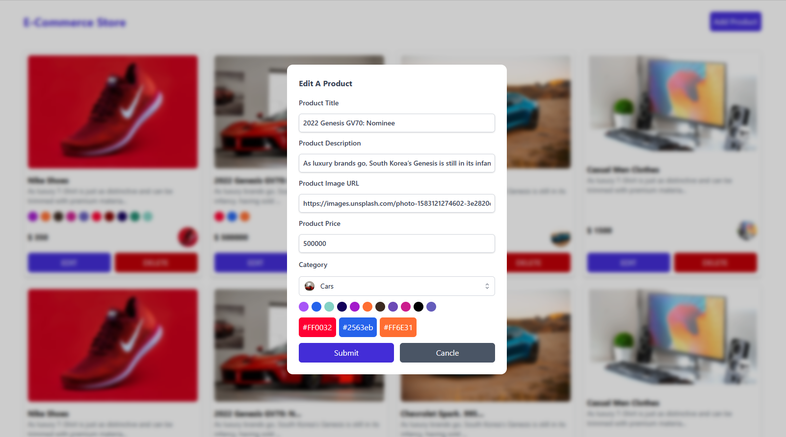
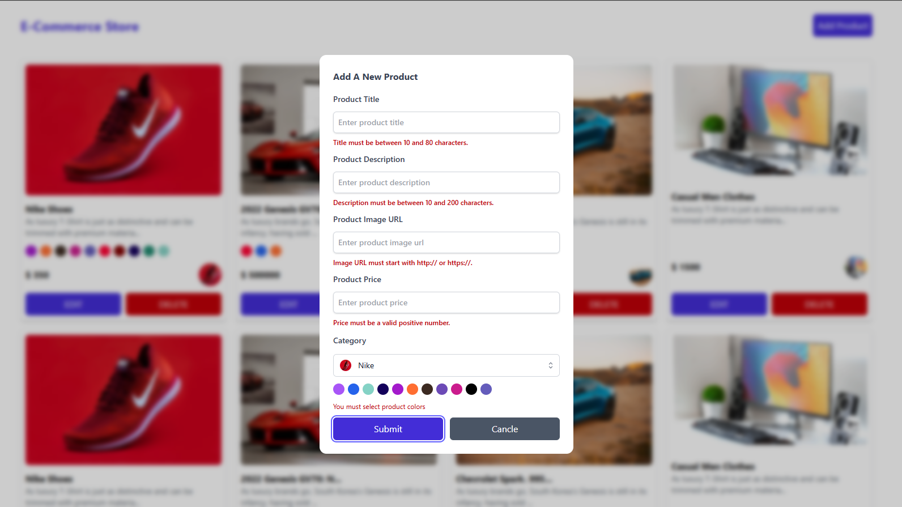
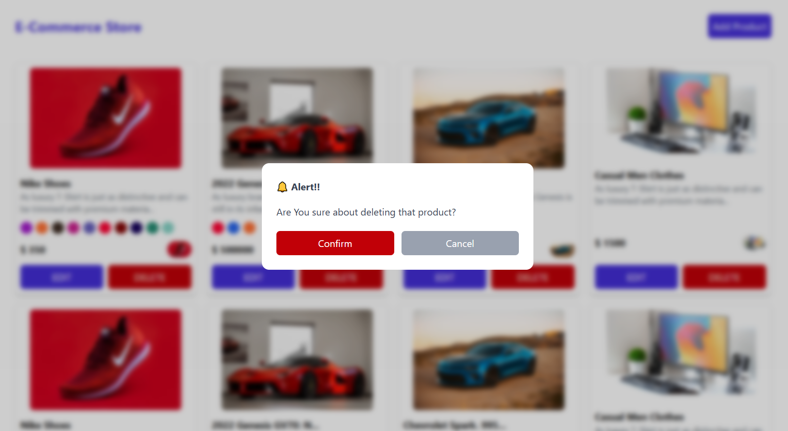
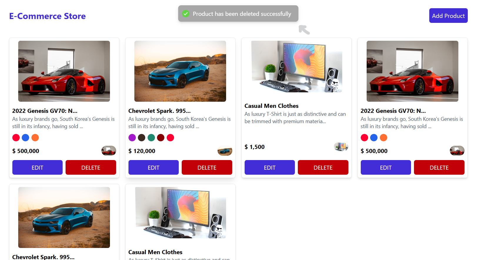

# E-Commerce Store

A simple, clean, and well-structured e-commerce front-end built with **React Vite**, **TypeScript**, and **Tailwind CSS**. This project allows you to add, edit, and display products with color and category selections.

---

## [Demo Live Site](https://curd-e-commerce.vercel.app/)

---

## Features

- Add & Edit product via modal form
- Color selection with visual indicators
- Category dropdown with image thumbnails
- Reusable form component for both creation & editing
- Fully typed using TypeScript
- Tailwind-based modern UI
- Simple mock data with local state

---

## Tech Stack

- [React](https://reactjs.org)
- [TypeScript](https://www.typescriptlang.org)
- [Tailwind CSS](https://tailwindcss.com)
- [Headless UI](https://headlessui.com)
- [Heroicons](https://heroicons.com)
- [toast](https://react-hot-toast.com)
- [uuid](https://www.npmjs.com/package/uuid)

---

## Project Structure

```
src/
│
├── assets/
│
├── components/
│   ├── ui/
│   │   ├── Button.tsx
│   │   ├── Form.tsx
│   │   ├── Image.tsx
│   │   ├── Input.tsx
│   │   ├── Modal.tsx
│   │   └── Select.tsx
│   ├── CircleColor.tsx
|   ├── ErrorMessage.tsx
│   ├── ProductCard.tsx
│
├── constants/
│   └── index.ts
│
├── data/
│   └── index.ts
│
├── interfaces/
│   └── index.ts
│
├── pages/
│   ├── Home.tsx
│   └── Products.tsx
│
├── types/
│   └── index.ts
│
├── utils/
│   └── functions.ts
│
└── validation/
    └── index.ts
```

---

### Lighthouse Analysis


---

## App Previews

### Home Page


### Edit Product



### Form Validation



### Alerts



### Affirmations



---

## Getting Started

### 1. Clone the repo

```bash
git clone https://github.com/emanmohamedsr/CURD_ECommerce.git
cd CURD_ECommerce
```

### 2. Install dependencies

```bash
npm install
# or
yarn
```

### 3. Run the app

```bash
npm run dev
# or
yarn dev
```
